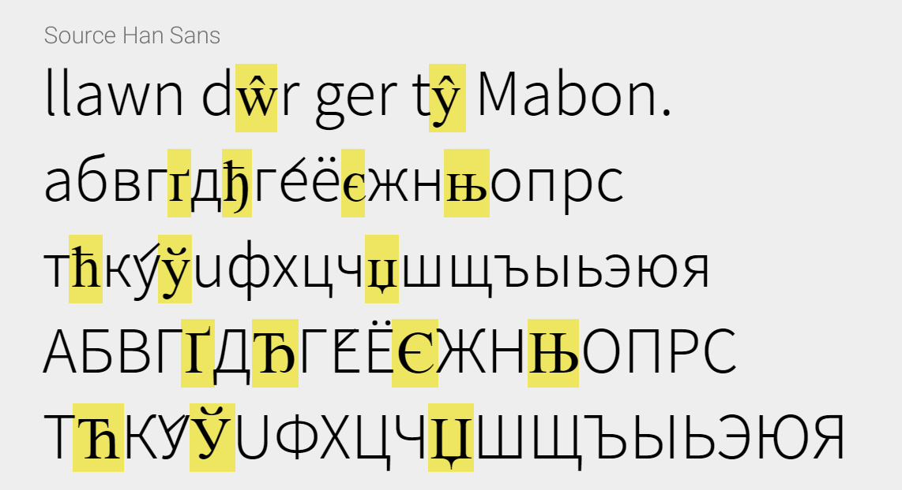
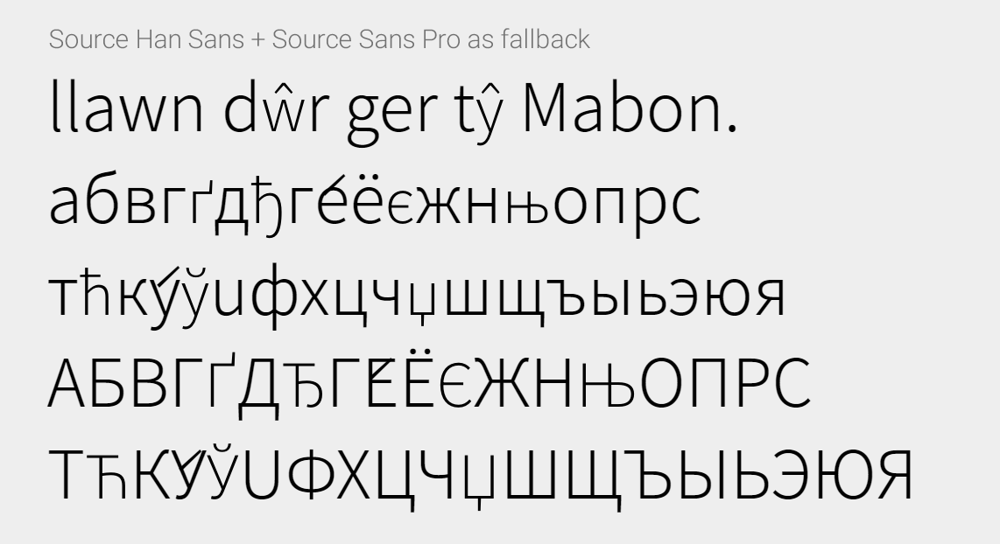
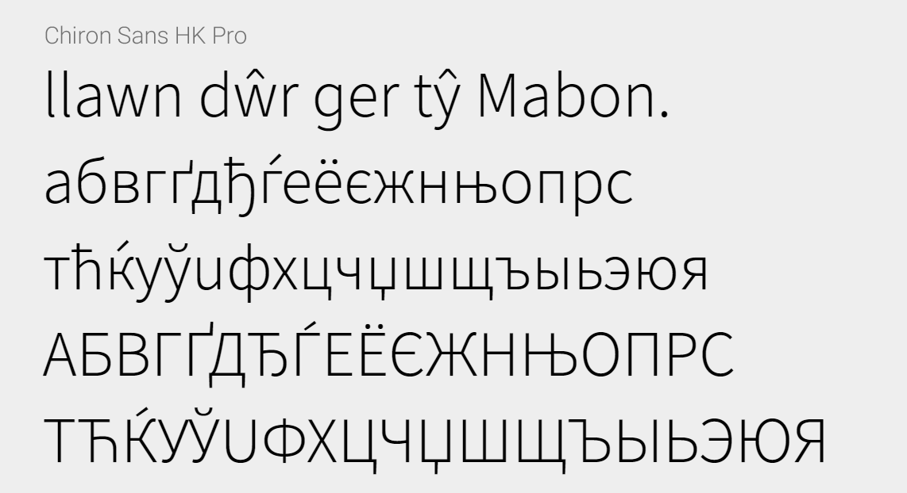

昭源黑體 Pro (Chiron Sans HK Pro)
==================

[English README 英文版說明](README.md)

## 關於本字體

> TL;DR: 昭源黑體 + Source Sans 3 = 昭源黑體 Pro

昭源黑體 Pro 是一款在[昭源黑體](https://github.com/chiron-fonts/chiron-sans-hk)之上加入 [Source Sans Pro](https://github.com/adobe-fonts/source-sans-pro/) 的完整字集的中文黑體。

昭源黑體旨在提供一款採現代筆形風格、平衡標準字形和印刷體慣用筆形、與商業中文字體取態類近的免費開源黑體字型。昭源黑體以思源黑體香港版為基礎開發，而思源黑體的 LGC （指 Latin, Greek 和 Cyrillic，即拉丁、希臘、西里爾字母）字元則來自 Source Sans Pro。由於技術原因，一個字型檔案可以容納的字元數是有限的。思源黑體是一款多語系的泛中日韓字體，在支援了各種中日韓字集標準後，所餘空間已經不多，不足以容納全部 Source Sans Pro 字元，因此思源黑體的 LGC 字元覆蓋相比 Source Sans Pro 要少得多。於是我們會遇到明明一個字元在 Source Sans Pro 已有收錄、在思源黑體卻付闕的情況：

遺憾的是，遇到上述情況，將 Source Sans Pro 設為思源黑體的後補字型仍不能解決問題。原因是，Source Sans Pro 的 LGC 字元在併入思源黑體之前經過縮放、插值生成不同粗幼等處理，跟原本 Source Sans Pro 在相同大小和字重的字元已經無法相配，二者混用成效不佳：

由於昭源黑體的目標是提供一款繁體（正體）中文字形經過訂製的字體，不支援地區字形轉換，本來在思源黑體中放置其他地區字形的約 16,900 個字元空間便可以騰空作其他用途。昭源黑體 Pro 就是利用這些空間將整套 Source Sans Pro 收入其中。

## 特色

「昭源黑體 Pro」特色如下：

* 包含下列「昭源黑體」特點：
  - 超過 2,700 個重新對映中文字元。
  - 超過 1,300 個經修改中文字元。
  - 超過 1,000 個原思源黑體未有收錄的中文字元。
  - 預設輸出半形的西文單雙引號，即 U+2018 (‘)、U+2019 (’)、U+201C (“) 和 U+201D (”)。
  - 移除全形標點符號相關之 `halt`、`vhal`、`palt` 和 `vpal` 指令。
* 收齊 Source Sans Pro 最新版 (3.0) 所有字符。
* 包含 Source Sans Pro 字體的所有 OpenType 特性。

## 安裝

`build/` 目錄內有可安裝的字型檔案，屬 OpenType/CFF (OTF) 格式，包含 7 個字重，字體名稱是 Chiron Sans HK Pro。

注：因應 Windows 系統的字型名稱長度限制，本字體的 _ExtraLight_ 字重會改為 _ExtraLt_。

## 整合詳情

本節會提供有關昭源黑體 Pro ―― 即將 Source Sans Pro 字元融入昭源黑體 ―― 製作上的一些資料。留以下面談到 LGC 字元部份，昭源黑體跟思源黑體的情況是相同的。

### LGC 字元

跟思源黑體一樣，為保持與中文等字元混排時的效果，昭源黑體 Pro 的 LGC 字元都是先經縮放、插值處理再作嵌入。不過，昭源黑體 Pro 所採用的縮放、插值參數跟思源黑體並不相同。首要原因當然是因為我不知道思源黑體處理 Source Sans Pro 原字形所用的參數。而且，由於產生字體檔的流程不同，我大抵不能將原有的處理方法完全重現。另外，基於個人喜好，我刻意選擇了一個比思源黑體略小的縮放參數。換言之，昭源黑體 Pro 並不是單純將字體中缺少的字元用 Source Sans Pro 填補，而是昭源黑體中固有的全套 LGC 字元也會用 Source Sans Pro 處理後的字形取代。

結果是，昭源黑體 Pro 的西文字元間距等參數跟昭源黑體並不相同，切換字體後或會造成版面（例如行數）改變。請勿將昭源黑體 Pro 當成昭源黑體/思源黑體的直接取代品。

### OpenType 字型功能

Source Sans Pro 提供非常豐富的 OpenType 字型功能，這些功能可以用來提供替代字形樣式，甚至是為正確描繪字元作出必要指示。昭源黑體 Pro 盡力完整保留這些字型功能。而思源黑體原有的相同字型功能會被取代。

### 新增的交替字形樣式

雖然之前提到昭源黑體中既有的 LGC 字形會被 Source Sans Pro 取代，但實際執行時有某些字元（主要是 ▲、♠、← 等符號）須作特殊處理。這些字元在 Source Sans Pro 是以「調和」 (proportional) 形式呈現，但在思源黑體則是以「全形」形式顯示。由於歷史原因，使用者會期望大多數此類字元在中文字體是以全形描繪。因此，貿然一刀切以 Source Sans Pro 的調和字元取而代之並非良策。昭源黑體 Pro 的處理方式如下：

#### 預設為全形款式

以下字元，昭源黑體原有的全形版本會保留作為預設提供的式樣。至於其所相對應、Source Sans Pro 中的調和字式樣則可通過「語言標示」（即 `locl` 功能）或 OpenType 的 Stylistic Set (`ss11`) / Character Variants (`cv20`) 功能調出。

> ←, ↑, →, ↓, ↖, ↗, ↘, ↙, ⇐, ⇒, ↔, ↕, ●, ○, ■, □, ◆, ▲, △, ▶, ▷, ▼, ▽, ◀, ◁, ◉, ♥, ♣, ♦, ♠, ♀, ♁, ♂

#### 預設為調和款式

以下字元會以 Source Sans Pro 中的調和字作為預設提供的式樣，而昭源黑體中原有的全形版本則可以 OpenType 的 Stylistic Set (`ss12`) / Character Variants (`cv20`) 功能調出.

> ·, •, ×, ÷, ◦, ▪, ▫, †, ‡, §, ¶, ‖, ∕, ≤, ≥, ±, ≠, ≈, ∩, ∟, ∞, ‵, √, ∀, ∃, ∶, ∷, ∑, ∏, ℅.

### 數字

思源黑體本來有提供專門為中文排版作過調整的標號和數字字形。在數字 U+0030 (0) 至 U+0039 (9) 的情況，預設會輸出「中文排版適用」的版本，至於「西文排版適用」版本則可通過「語言標示」（即 `locl` 功能）調出。Source Sans Pro 並無此「中文排版適用」版本。

而在 Source Sans Pro，預設數字的字高會比大寫英文字母略矮。與大寫英文字母等高的版本則須透過 OpenType 的 `case` 功能調出。

昭源黑體 Pro 將 Source Sans Pro 的「大寫英文字母等高」版本的數字字形設為唯一輸出樣式。至於用來切換中西排版版本數字的 `locl` 功能則會移除。

### 其他變更

以下變更，純為滿足個人喜好而做：

1. U+0067 (g) 改為單圈 (single storey) 版，原有的雙圈 (double storey) 版可通過 OpenType `ss04` 或 `cv03` 功能取得（即與 Source Sans Pro 的做法相反）。
2. 移除 U+0031 (1) 腳底的橫筆。
3. 垂直置中版本的 U+203C (‼)、U+2047 (⁇)、U+2048 (⁈)、U+2049 (⁉) 改為全形，而 Source Sans Pro 中的調和版本可經由 Opentype 功能 `ss11` 或 `cv20` 取得。
4. 原本的思源黑體或昭源黑體預調會輸出西文排版適用的 U+2E3A (⸺) 和 U+2E3B (⸻)，而中文排版適用版本則須透過語言標示調出。不過某些應用程式（如 Microsoft Word）對這些碼位的語言標示支援不是很好，所以在昭源黑體 Pro 會改為預設輸出這些字元的中文排版適用版本，至於西文排版適用版本則可經由 Opentype 功能 `ss12` 或 `cv21` 取得。

## 授權

昭源黑體 Pro 採用 SIL Open Font License 版本 1.1 授權。授權全文可到 [https://scripts.sil.org/OFL_web](https://scripts.sil.org/OFL_web) 查閱。
